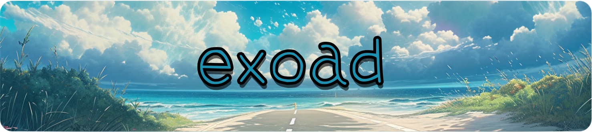
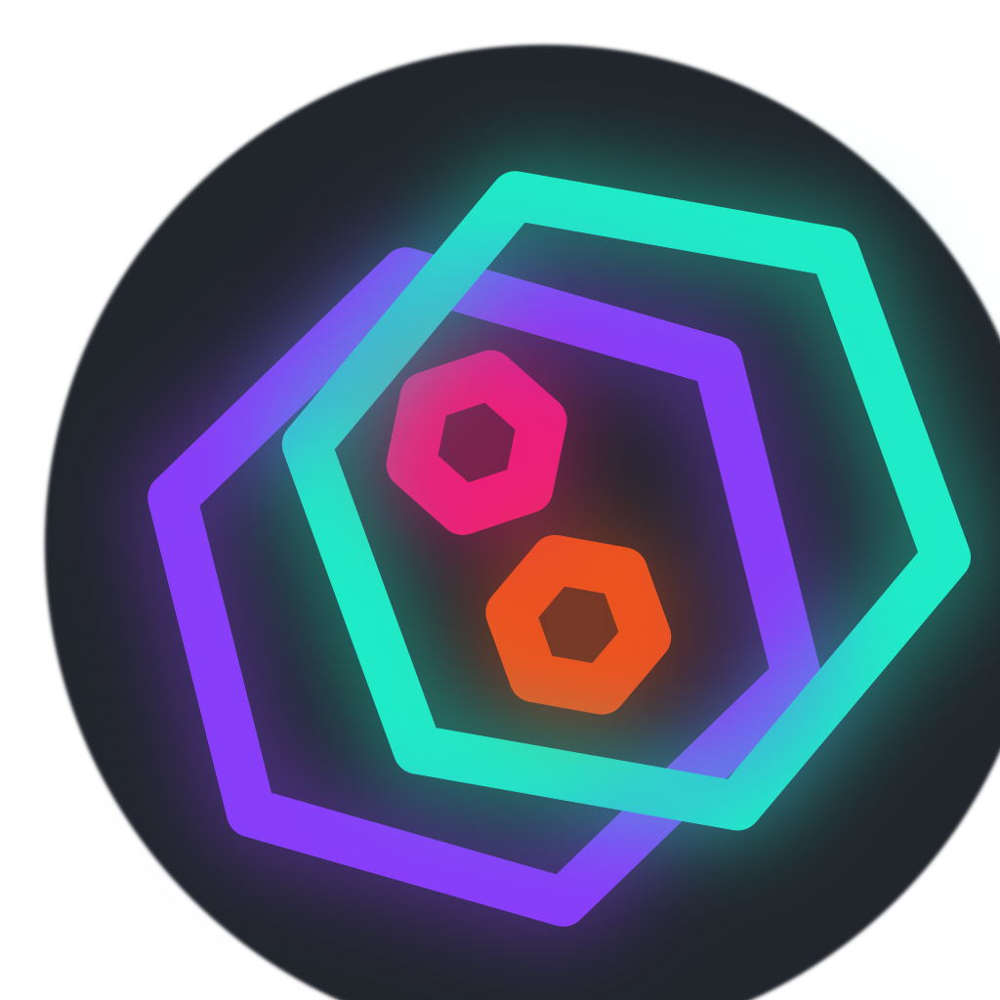
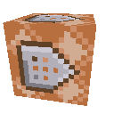
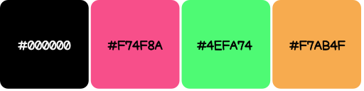

<h1 align="center">
  
</h1>

> [!WARNING]
> ***English** version* | [`中文`](https://github.com/exoad/exoad/blob/main/README_ZH.md)

 <strong>Hoi there!</strong> I am exoad, a student from New York and I love to
  code. <strong>I am experienced with systems and
    low-level programming</strong> with frameworks primarily in graphics in <strong>OpenGL</strong> and
  <strong>Cuda</strong>. Additionally, I have been building many GUI desktop apps primarily with my own <strong>Java
    Swing</strong> adaptation and more recently, <strong>Flutter</strong>. Recently, I have been learning <a
    href="https://www.monogame.net/"><strong>MonoGame</strong></a> and <a
    href="https://libgdx.com/"><strong>LibGDX</strong></a> for game development.

<h2>some projects</h2>

Here are some of the projects that I have worked on recently

<ul>
  <li>
    <a href="https://github.com/Halcyoninae"> 
    <strong>Halcyon</a> —</strong> Audio player with a nice GUI to go with it.
  </li>
  <li>
    <a href="https://github.com/exoad/yttriuslang.c"> <strong>Yttrius</a>
    —</strong> A simple compiled and extensible programming language.
  </li>
  <li>
    <a href="https://github.com/exoad/prismix"> 
    <strong>Prismix </a></strong>— Simple tool for dealing with colors
  </li>
</ul>

  
Here are some more projects I have released publicly:
  

  <ul>
    <li>
      <a href="https://github.com/exoad/com.jackmeng"> 
        <strong>com.jackmeng </a></strong>— A library of a bunch of random things to help with developing in Java
    </li>
    <li>
      <a href="https://github.com/exoad/animas-firefox"> 
        <strong>Firefox Animas </a></strong>— Anime themes for Firefox
    </li>
    <li>
      <a href="https://github.com/exoad/toasterify"> 
        <strong>Toasterify </a></strong>— An Android app to warm up your phone to warm up your hands in cold times
    </li>
    <li>
      <a href="https://github.com/exoad/ansicolor"> 
        <strong>ansicolor </a></strong>— A Java library to make dealing with ANSI coloring and prettifying CLI text
      easier
    </li>
    <li>
      <a href="https://github.com/exoad/usaco_mashups"> 
        <strong>USACO Mashups </a></strong>— Discord Bot is written in NodeJS and Java to help with creating problem
      sets for the USACO competition
    </li>
    <li>
      <a href="https://github.com/exoad/meta_javac"> 
        <strong>Meta4J </a></strong>— An attempt to add meta programming into Java with the help of the inbuilt
      annotation API
    </li>
  </ul>
  and more!

<h2>what i use</h2>
<ul>
  <li>
    

      

        <h3>  <strong>Frameworks —</strong> Libraries, toolkits, engines, and
          more...
        </h3>
      

      <ul>
        <li><a href="https://www.glfw.org/"> GLFW</a> -
          Utilized for my faster Swing reimplementation</li>
        <li><a href="https://flutter.dev"> Flutter</a> -
          Learned after migrating from Swing for general GUI apps creation</li>
        <li><a href="https://docs.oracle.com/en/java/javase/17/docs/api/java.desktop/javax/swing/package-summary.html">
            Swing</a>
          - My original GUI library for all my languages to include bindings for programs from other languages.
        </li>
        <li><a href="https://github.com/Kode/Kha"> Kha</a> - My previous rendering pipeline before SDL2</li>
        <li><a href="https://www.monogame.net/"> MonoGame</a> - Currently learning for getting into game development</li>
        <li><a href="https://nodejs.org/en"> NodeJS <em>[including NPM
              packages]</em></a> - Mainly used for creating Discord bots and lightweight server-based hosting apps.</li>
        <li><a href="https://llvm.org/"> LLVM</a>
        </li>
        <li><a href="https://tauri.app/"> Tauri</a> - Recently getting
          into web development along with learning Rust and migrating most of my public and private projects to Rust
        </li>
        <li><a href="https://skia.org/"> Skia</a> - Utilized for my latest reimplementation of the Swing backend with Skia</li>
      </ul>
    

  </li>
  <li>
    

      

        <h3> <strong>Languages —</strong> Programming languages that I have
          utilized
          a lot</h3>
      

      <ul>
        <li>
          <strong>Object Oriented</strong>
          <ul>
            <li>Java/Kotlin (~4) - Swing and Android Apps</li>
            <li>Dart (>2) - Flutter</li>
            <li>C++ (>4) - Skia and GLFW</li>
            <li>Haxe (~2) - OpenFL and Kha</li>
            <li>C# (~0.1) - MonoGame and Dot NET</li>
          </ul>
        </li>
        <li>
          <strong>Script-based</strong>
          <ul>
            <li>JavaScript (>2) - NodeJS and Dart for the web</li>
            <li>Lua (>4) - Inconjunction with C</li>
          </ul>
        </li>
        <li>
          <strong>General</strong>
          <ul>
            <li>C (>5) - Compiler Design and Systems</li>
            <li>Rust (~0.1) - Tauri</li>
          </ul>
        </li>
      </ul>
    

  </li>
  <li>
    

      

        <h3> <strong>Environment
            —</strong> What I use to code</h3>
      

      <ul>
        <li><strong>Editors</strong>:  </li>
        <li><strong>Browser</strong>: </li>
        <li><strong>OS</strong>: </li>
      </ul>
    

  </li>
</ul>
<h2>stats</h2>

  
  

<h2>extras</h2>
<be>
  

    
🎨 my design

    Here are the main colors that I use in most current-day GUI apps: 
    
  

  

    

      <strong>🎀 inquiries?</strong>
    

    If you have inquiries regarding my software, give me a forward through my Discord server: <a
      href="https://discord.gg/PbJQRT9zQ8">https://discord.gg/PbJQRT9zQ8</a>
     
    If there is an issue with incorrect rendering of this profile, please submit a PR through this <a href="https://github.com/exoad/exoad">profile's repo</a>
  

  

    

      🏮 cool picture
    

    

      
    

  

  

    
     

> [!IMPORTANT]
> **Thank you** for checking out my profile, **have a great day**! ☕ &#x2303;_&#x2303;

  

