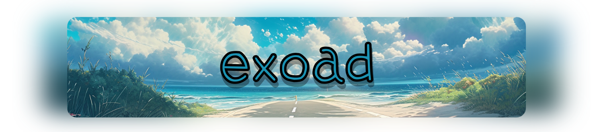
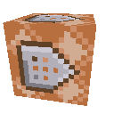
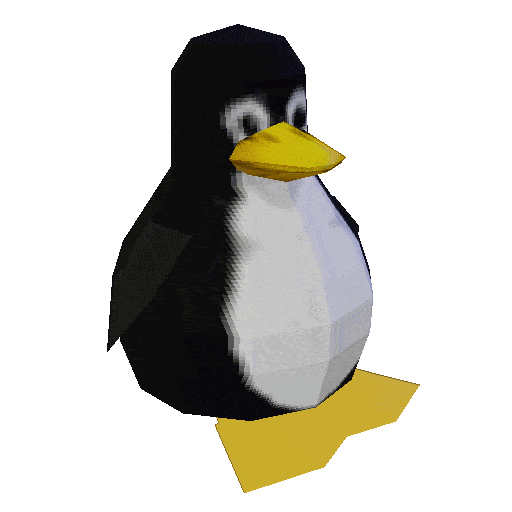
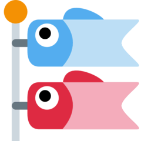
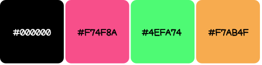
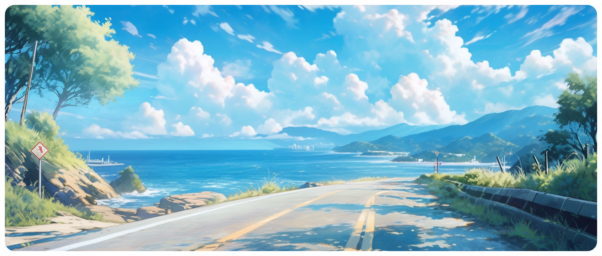

<h1 align="center">
  
</h1>

 Hi! I am **exoad**, a high schooler from New York. **I am experienced in systems and low-level programming** with frameworks primarily in graphics in **OpenGL** and **Cuda**. Additionally, I have been building many GUI desktop apps primarily with my own **Java Swing** adaptation and more recently, **Flutter**. Lastly, I am currently learning [**MonoGame**](https://www.monogame.net/) and [**LibGDX**](https://libgdx.com/) in preparation for my journey with game development.

<h2>some projects</h2>

Here are some of my **public** projects I have made and have received some updates in recent times.

<ul>
  <li>
    <a href="https://github.com/Halcyoninae">  <strong>Halcyon</a>   —</strong>   Audio player with a nice GUI to go with it.
  </li>
  <li>
    <a href="https://github.com/exoad/yttriuslang.c">  <strong>Yttrius</a>   —</strong>   A simple compiled and extensible programming language.
  </li>
  <li>
    <a href="https://github.com/exoad/com.jackmeng">  <strong>com.jackmeng</a>   —</strong>   Tool box of random things for Java.
  </li>    
</ul>

<h2>what i use</h2>

<ul>
  <li>
    <h4>  <strong>Frameworks   —</strong>   Libraries, toolkits, engines, and more...</h4>
    

      

        list them!
      

    <ul>
      <li><a href="https://www.glfw.org/"> GLFW</a></li>
      <li><a href="https://flutter.dev"> Flutter</a></li>
      <li><a href="https://docs.oracle.com/en/java/javase/17/docs/api/java.desktop/javax/swing/package-summary.html"> Swing</a></li>
      <li><a href="https://github.com/Kode/Kha"> Kha</a></li>
      <li><a href="https://www.google.com/search?client=firefox-b-1-d&q=libgdx"> LibGDX</a></li>
      <li><a href="https://www.monogame.net/"> MonoGame</a></li>
      <li><a href="https://nodejs.org/en"> NodeJS <em>[including NPM packages]</em></a></li>
      <li><a href="https://llvm.org/"> LLVM</a></li>
      <li><a href="https://github.com/Kode/Kha"> Kha</a></li>
      <li><a href="https://tauri.app/"> Tauri</a></li>
      <li><a href="https://skia.org/"> Skia</a></li>
    </ul>
    

  </li>
  <li>
    <h4> <strong>Languages   —</strong>   Programming languages that I have utilized a lot</h4>
    

    

      list them!
    

    <ul>
      <li>
        <strong>Object Oriented</strong>
        <ul>
          <li>Java/Kotlin (>3) </li>
          <li>Dart (>2)</li>
          <li>C++ (>4)</li>
          <li>Haxe (>3)</li>
          <li>C# (>0.5)</li>
        </ul>
      </li>
      <li>
        <strong>Script-based</strong>
        <ul>
          <li>JavaScript (>2)</li>
          <li>Lua (>4)</li>
        </ul>
      </li>
      <li>
        <strong>General</strong>
        <ul>
          <li>C (>5)</li>
          <li>Rust (>0.5)</li>
        </ul>
      </li>
    </ul>
    

  </li>
  <li>
    <h4> <strong>Environment   —</strong>   What I use to code</h4>
    

    
list them!

    <ul>
      <li><strong>General Editor</strong>: <a href="https://code.visualstudio.com/">VSCode</a></li>
      <li><strong>OS</strong>: <a href="https://manjaro.org/"> Manjaro (KDE)</a></li>
    </ul>
    

  </li>
</ul>

  

my socials > 

<be>

  
🍚 my design

  I do not have a specific design that you can recognize. However, my main color palette is these colors:

  

  **in the old days,** my main color was `#89eda4`: a bright teal/mint color.

<strong>🎀 inquiries?</strong>

  
if you have inquiries regarding my software, give me a forward through my discord server: [link](https://discord.gg/PbJQRT9zQ8)

  

    🏮 cool picture
  

  

