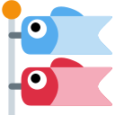

<h1 align="center">
  
</h1>

 <strong>Hi there!</strong>I am exoad, a high schooler from New York. <strong>I am experienced in systems and
    low-level programming</strong> with frameworks primarily in graphics in <strong>OpenGL</strong> and
  <strong>Cuda</strong>. Additionally, I have been building many GUI desktop apps primarily with my own <strong>Java
    Swing</strong> adaptation and more recently, <strong>Flutter</strong>. Lastly, I am currently learning <a
    href="https://www.monogame.net/"><strong>MonoGame</strong></a> and <a
    href="https://libgdx.com/"><strong>LibGDX</strong></a> for my game development dive.

<h2>some projects</h2>

Here are some of my <strong>recent</strong> projects I have made and have received some updates in recent times.

<ul>
  <li>
    <a href="https://github.com/Halcyoninae"> 
      <strong>Halcyon</a> —</strong> Audio player with a nice GUI to go with it.
  </li>
  <li>
    <a href="https://github.com/exoad/yttriuslang.c">  <strong>Yttrius</a>
    —</strong> A simple compiled and extensible programming language.
  </li>
  <li>
    <a href="https://github.com/exoad/com.jackmeng"> 
      <strong>com.jackmeng</a> —</strong> Tool box of random things for Java.
  </li>
</ul>
<h2>what i use</h2>
<ul>
  <li>
    <h4>  <strong>Frameworks —</strong> Libraries, toolkits, engines, and more...
    </h4>
    

      

        list them!
      

      <ul>
        <li><a href="https://www.glfw.org/"> GLFW</a></li>
        <li><a href="https://flutter.dev"> Flutter</a></li>
        <li><a href="https://docs.oracle.com/en/java/javase/17/docs/api/java.desktop/javax/swing/package-summary.html">
            Swing</a>
        </li>
        <li><a href="https://github.com/Kode/Kha"> Kha</a></li>
        <li><a href="https://www.google.com/search?client=firefox-b-1-d&q=libgdx"> LibGDX</a></li>
        <li><a href="https://www.monogame.net/"> MonoGame</a></li>
        <li><a href="https://nodejs.org/en"> NodeJS <em>[including NPM
              packages]</em></a></li>
        <li><a href="https://llvm.org/"> LLVM</a>
        </li>
        <li><a href="https://github.com/Kode/Kha"> Kha</a></li>
        <li><a href="https://tauri.app/"> Tauri</a></li>
        <li><a href="https://skia.org/"> Skia</a></li>
      </ul>
    

  </li>
  <li>
    <h4> <strong>Languages —</strong> Programming languages that I have utilized
      a lot</h4>
    

      

        list them!
      

      <ul>
        <li>
          <strong>Object Oriented</strong>
          <ul>
            <li>Java/Kotlin (>3) </li>
            <li>Dart (>2)</li>
            <li>C++ (>4)</li>
            <li>Haxe (>3)</li>
            <li>C# (>0.5)</li>
          </ul>
        </li>
        <li>
          <strong>Script-based</strong>
          <ul>
            <li>JavaScript (>2)</li>
            <li>Lua (>4)</li>
          </ul>
        </li>
        <li>
          <strong>General</strong>
          <ul>
            <li>C (>5)</li>
            <li>Rust (>0.5)</li>
          </ul>
        </li>
      </ul>
    

  </li>
  <li>
    <h4> <strong>Environment
        —</strong> What I use to code</h4>
    

      
list them!

      <ul>
        <li><strong>Editors</strong>:  </li>
        <li><strong>Browser</strong>: </li>
        <li><strong>OS</strong>: </li>
      </ul>
    

  </li>
</ul>
<h2>stats</h2>

  
  
  

    my socials >
    
    
    
    
  

<be>
  

    
🎨 my design

    I do not have a specific design that you can recognize. However, my main color palette in these colors:
    
    <strong>in the old days</strong>, my main brand color was <code>#89eda4</code>: a bright teal/mint color.
  

  

    

      <strong>🎀 inquiries?</strong>
    

    if you have inquiries regarding my software, give me a forward through my discord server: <a
      href="https://discord.gg/PbJQRT9zQ8">https://discord.gg/PbJQRT9zQ8</a>
  

  

    

      🏮 cool picture
    

    

      
    

  

  

    
  
